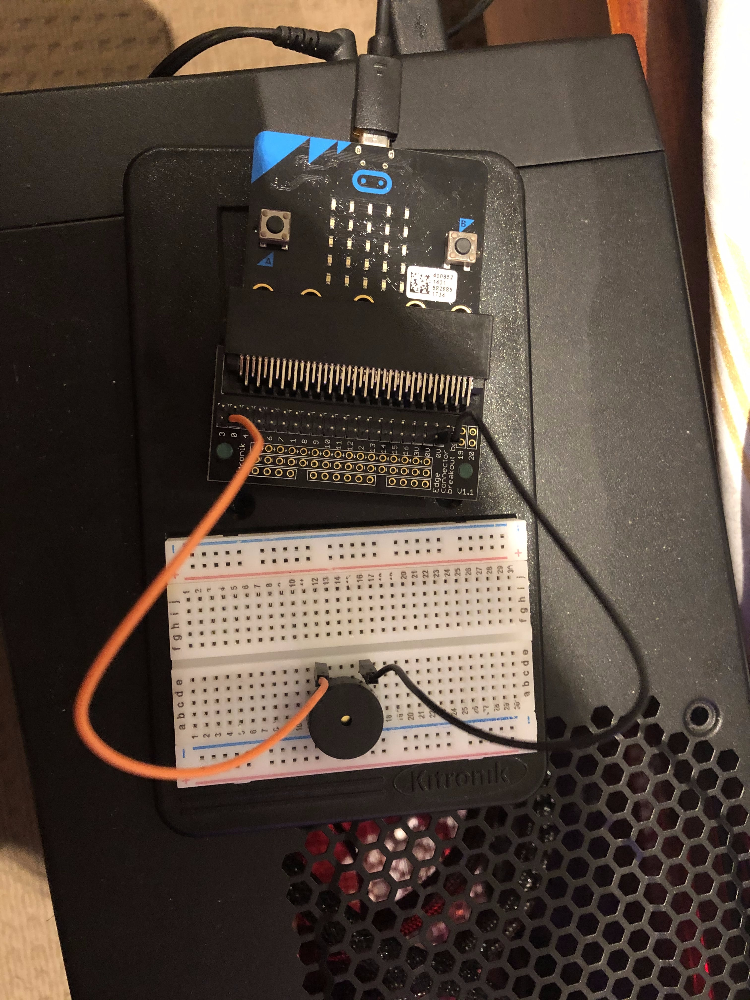

# Inventor Kit Experiments

*Markdown reference: https://guides.github.com/features/mastering-markdown/*

## Instructions ##

*For a selection of 5 inventor kit experiments that you choose, fill out the following sections.

### Experiment name ###

Using an LDR and analog inputs.

#### Photo of completed project ####
In the code below, replace `missingimage.png` with the name of the image, which should be in the `kitexperiments` folder.

Photo shown the successful experiment of lighten up the LED with light sensor within a complece circuit. 

#### Reflection ####

This is one of the very first experiments with the micro bit, it teaches me how to complete an electric circuit with wire, resistant and LED light, and how to control the compont using the code. This is a critical technique for the feature project using the micro bit. 

This experiment could be the basis of a real world application such as the red light green light for the pedestrian crossing; the icon will change if the user pressed the button in this experiment it used the light sensor to change the icon. Which means it can do the same thing if we just change the code. 

### Experiment name ###

Using a transistor to drive a motor.

#### Photo of completed project ####
*In the code below, replace imagemissing.jpg with the name of the image, which should be in the kitexperiments folder.*

Photo shown the successful experiment of using the pulse to control the fan speed.

#### Reflection ####

In this experiment, something new to me was or something I learned was how to insert and operate the transistor, motor and fan, and how to use code to control the fan speed with pulse. Also how to power up something that need a lot of power, in this case the motor. We use the transistor to allow a lot of current to flow through to motor which give it enough power to work. This is important for the feature if we need to operate something that need a lot of power. 

This experiment could be the basis of a real world application such as button to turn electric component on or off. The light, the computer, fan etc. All of these device require a transistor to control the current flow. And daily life device which requires good sound quality because transistor are often used in amplifying circuits. 

### Experiment name ###

Setting The Tone With A Piezo Buzzer

#### Photo of completed project ####
In the code below, replace imagemissing.jpg with the name of the image, which should be in the kitexperiments folder.

(Insert a caption here)

#### Reflection ####

In this experiment, something new to me was or something I learned was (insert something here).

This experiment could be the basis of a real world application such as (insert something here).

### Experiment name ###

Making a Pedestrian Crossing

#### Photo of completed project ####
In the code below, replace imagemissing.jpg with the name of the image, which should be in the kitexperiments folder.

(Insert a caption here)

#### Reflection ####

In this experiment, something new to me was or something I learned was (insert something here).

This experiment could be the basis of a real world application such as (insert something here).

### Experiment name ###

Making A Random Dice

#### Photo of completed project ####
In the code below, replace imagemissing.jpg with the name of the image, which should be in the kitexperiments folder.

(Insert a caption here)

#### Reflection ####

In this experiment, something new to me was or something I learned was (insert something here).

This experiment could be the basis of a real world application such as (insert something here).

