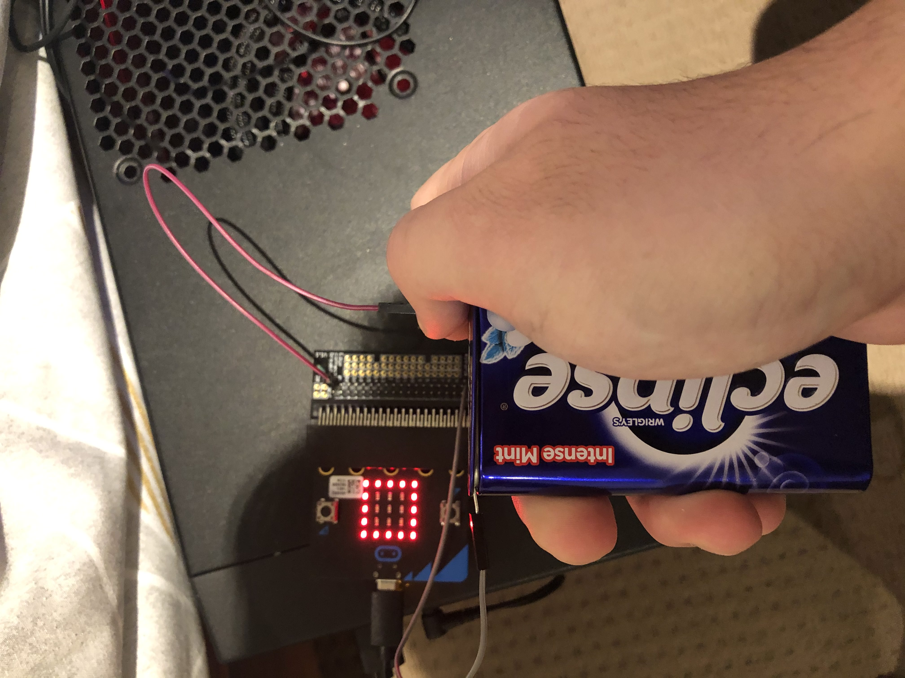
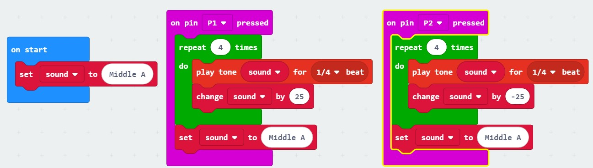
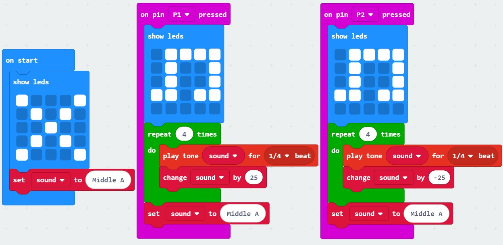
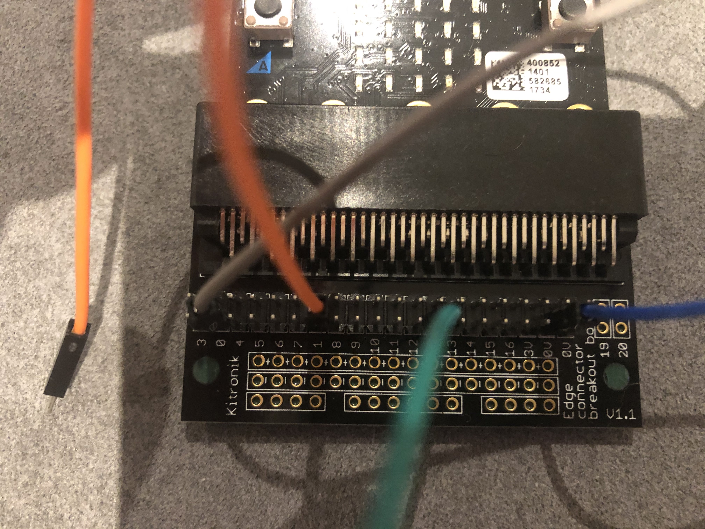
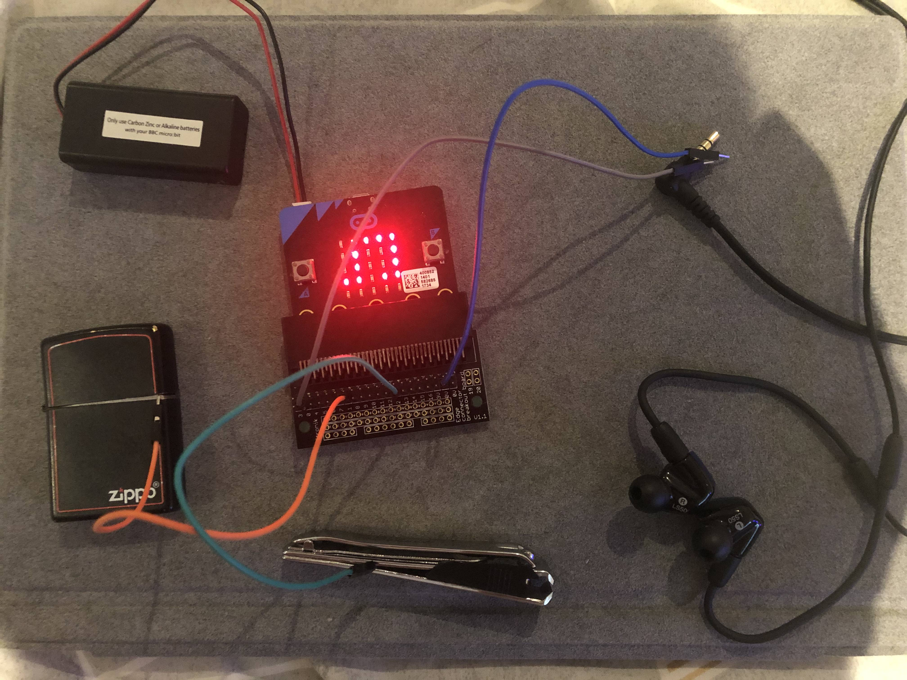
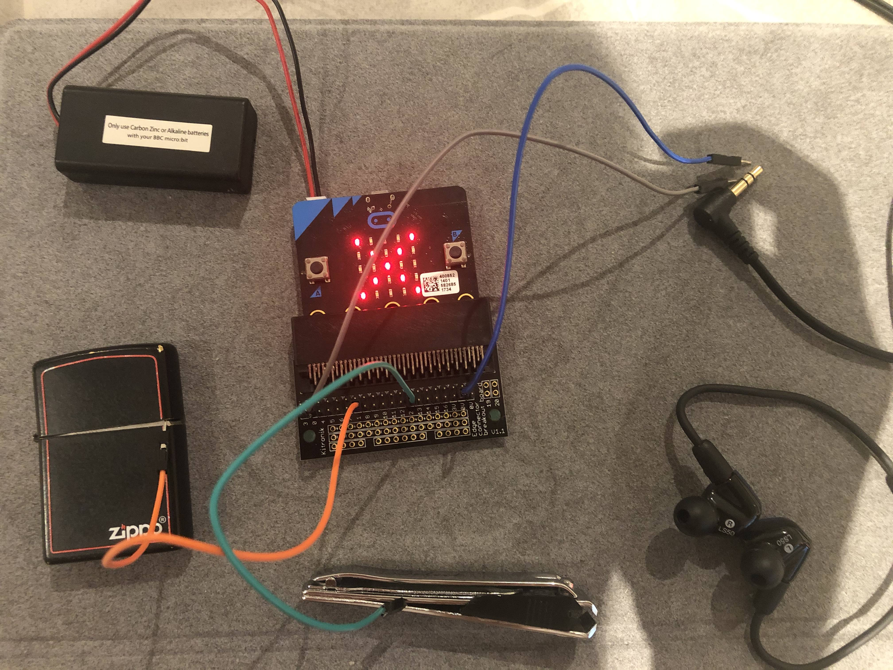

# Assessment 1: Replication project

*Fill out the following workbook with information relevant to your project.*

*Markdown reference:* [https://guides.github.com/features/mastering-markdown/](http://guides.github.com/features/mastering-markdown/)

## Replication project choice ##
Turn anything conductive into button

## Related projects ##
*Find about 6 related projects to the project you choose. A project might be related through  function, technology, materials, fabrication, concept, or code. Don't forget to place an image of the related project in the* `replicationproject` *folder and insert the filename in the appropriate places below. Copy the markdown block of code below for each project you are showing, updating the number* `1` *in the subtitle for each.*

### Related project 1 ###
Banana keyboard

https://makecode.microbit.org/projects/banana-keyboard

This project is related to mine because both of the idea is to use something that is conductive as a keyboard.

## Reading reflections ##
*Reflective reading is an important part of actually making your reading worthwhile. Don't just read the words to understand what they say: read to see how the ideas in the text fit with and potentially change your existing knowledge and maybe even conceptual frameworks. We assume you can basically figure out what the readings mean, but the more important process is to understand how that changes what you think, particularly in the context of your project.*

*For each of the assigned readings, answer the questions below.*

### Reading: Don Norman, The Design of Everyday Things, Chapter 1 (The Psychopathology of Everyday Things) ###

Ever since I started to think of studying design, I always thought that a designer is to design products for people. It is like give and take. The designer designed something and the user use it as simple as that. I haven't really considered anything like user experience or feedback etc. 

Don used a few daily life examples to explain the importance of the consideration when designing a product for the specific users. A few keywords have been mentioned such as affordances, signifiers, conceptual models and feedback. To me, the most impressive idea is affordances and feedback. First, affordances, it genuinely means the relationship between a physical object and a person. It determent how the object could possibly be used. It changed my mind that the user experience is a big part of the design, it affected how well the product can be used for the specific group of users that we are designing for. Second, feedback, it means communicating the results of action toward the users. Which is a critical consideration in design as well. Users might feel annoying if there is too much or lack of feedback. Also, how to provide effective feedback with minimum costs and changes to the original design duty of a designer as well. 

I was wondering as a user, I believe the people who designed the products to actually sell them on the market especially those big international brand. What I often see is there is always something that is not satisfying on the design. I believe the people or team who designed it put in a lot of effort considering all of the situations when it is used. So why there is always some disadvantages to their products? It makes me wonder is it because there is no such thing as a perfect design or we can only design for "most" of the users but not "all" of the user.

When I am designing my own project, I can apply the signifiers and feedback idea in it. The keyboard itself doesn't have any sign on it to let users know what to do or if they are doing it right. If I can add some signifiers in it and give them feedback when they doing it right and wrong it can really improve the useability of the design.

### Reading: Chapter 1 of Dan Saffer, Microinteractions: Designing with Details, Chapter 1 ###

Before reading the article, I thought interaction have to be something big or additional to the design. Such as an extra screen, sound or LED light, etc. And when designing product for the users I always trying to control the user to interact with my design. 

After reading and analysis the article, I found out that interaction could be something within the design without the users even notice. Other than control the users to interact with my design. I can lead the users to interact with their intuition which is the best way to interact with them.  And it really doesn't have to be something big or noticeable. Dan used the toaster as an example and I think it is quite effective. The toaster doesn't have to have a screen or loud beep to let you know your toast is done. Instead, when the toast is done it will pop up and our intuition is to pick it up. This is a very simple interaction built in the design. And if you think deeper you will realize that the toaster itself is microinteractions. Of course in many other examples, it could be much more complicated but their basic concept is all the same.  

I want to know if there is a way to measure the level of the interaction and see how it changes the user experience. So we can decide whether we should add or reduce the interaction. 

The project I am doing requires interaction with the users. This article has given me an idea of how and what should I do when putting interaction in the design. Such as I can return some sounds or LED light when the users interacting with the design or show it on the micro bit screen. And the principle is effective and smooth, with no odd or unnecessary feedback.

### Reading: Scott Sullivan, Prototyping Interactive Objects ###

Before reading the article, I always thought the prototype must be something big or complete. Like at least 80% of the product and building it up with high level quailty. 

While now I know that's no quite the case in prototyping. Prototyping can be done in any stage when designing. And it can be done with wild range of tools. Actually, the more the tools you learned to use, the better your prototype and the final result will be. According to what the acticle said it is like opening whole new dimension each time you learn a new tool. In order the maximise the final outcome, familiar to the tools you use and learn other tools as much as you can. You will thank yourself in the feature. 

I wanna to know more tools we can use for making the product. Such as sketching, mapping, concepting and making physical product. That sooner I learn, the better I can do in the next project. 

For this project, I always feel like I am limit by the tools I know. This gives me an idea why, and I should change my mind. In the pass I always thinking what can I do with the tools I know. But now I should think what tools I can use to help develop my idea. I might try to use different tools in this project. 

## Interaction flowchart ##
*Draw a flowchart of the interaction process in your project. Make sure you think about all the stages of interaction step-by-step. Also make sure that you consider actions a user might take that aren't what you intend in an ideal use case. Insert an image of it below. It might just be a photo of a hand-drawn sketch, not a carefully drawn digital diagram. It just needs to be legible.*

## Process documentation

*In this section, include text and images that represent the development of your project including sources you've found (URLs and written references), choices you've made, sketches you've done, iterations completed, materials you've investigated, and code samples. Use the markdown reference for help in formatting the material.*

*This should have quite a lot of information!*

*There will likely by a dozen or so images of the project under construction. The images should help explain why you've made the choices you've made as well as what you have done. Use the code below to include images, and copy it for each image, updating the information for each.*

This is the code I used to test the component.

 
This is the outcome of the first code.

This is the orginal code from the related project.

This is the code I modified for my own project, I added LED icon both before and after the sound is played. Cross mean the music haven't been played yet and the music icon mean the music is played.

This is the wire set up for the modified code. 

## Project outcome ##

https://www.youtube.com/watch?v=-5ka1FrSH1k

### Project title ###
Turn anything conductive into button

### Project description ###

This project allows the user to turn any thing that is conductive into a button. By pressing the button it will produce a sound. I set it up with 2 buttons which play different sound. This is just a simple example, it can be modified to play like an instrument. 

### Showcase image ###

*Try to capture the image as if it were in a portfolio, sales material, or project proposal. The project isn't likely to be something that finished, but practice making images that capture the project in that style.*

### Additional view ###

*Provide some other image that gives a viewer a different perspective on the project such as more about how it functions, the project in use, or something else.*

This is the photo of the product before anything button is pressed you can see the cross icon on the micro bit.

### Reflection ###

The most successful part I felt during the process is when I changed the fruit into something else and it still works. I know it supposed to, but it just makes me feel like I make some good changes. The part I want to improve is I should get some crocodile clip instead of using the wire that comes with the kit. As you can see in the video, I have to hold the cable with my hand and the connection of the cable is not very good as well. So the first time I tried it out it didn't work and makes me wonder if it is the code or I did the wire thing wrong. But it is just the bad connection of the wire. However, I am quite happy about the final outcome. Now I have a much better understanding of how the electric circuit works as well as the coding to control other components.

Obviously this project is based on the related project I mentioned earlier. The made code website describing how to make the banana keyboard is quite useful. As it teaches you how to wire things up as well as the code to control it. As a beginner of the micro bit, it is really easy to understand and learn from. Other than that the Kitronik Inventor’s Kit experiment 1-12 covered almost every component in the micro bit kit and teach me how to use it and build something interesting with it. I also think that the understanding of how the electric current works really helpful in the success of building this project.

I've seen other poeples in video they are using the kids toy teddy bear to perform music. (https://www.youtube.com/watch?v=1I_EPkHqU20&feature=youtu.be). He is not using the toy as a button, but he did use the conpect of turning something in other usage.

The extension of this project is it can turned into instrument by adding more conductive objects as long as it have enough pin and the correct code for it. The project itself isn't really going to do much in other situation, however, the concept would help when developing other product. Such as if you have a broken button in the build, you can use other thing to replace it like an orange, key or even yourself. 
